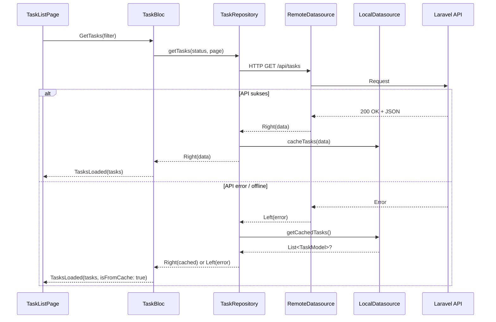

# 📋 Flutter Task Tracker App

Aplikasi Flutter untuk manajemen task yang terintegrasi dengan REST API Laravel Task Tracker.

---

## 📡 API Base URL

```
http://127.0.0.1:8000/api
```

---

## 🎯 Fitur Aplikasi

| Fitur | Deskripsi |
|-------|-----------|
| **Task List Page** | Menampilkan daftar task dari API dengan filter status (Semua/Pending/Done) |
| **Add Task** | Form tambah task baru dengan validasi lengkap |
| **Task Detail Page** | Menampilkan detail task lengkap termasuk timestamps |
| **Update Status** | Toggle status task antara Done dan Pending |
| **Delete Task** | Hapus task dengan konfirmasi dialog |

### ✨ Bonus Features

| Fitur | Deskripsi |
|-------|-----------|
| **Local Caching** | Task list di-cache ke SharedPreferences dengan expiry 5 menit |
| **Offline Support** | Saat offline/API error, otomatis fallback ke data cache + banner indikator |
| **Repository Pattern** | Single source of truth — API-first, cache fallback |
| **Infinite Scroll** | Pagination otomatis saat scroll ke bawah (10 items per page) |
| **Connectivity Indicator** | Indikator online/offline di AppBar + banner offline |
| **Reusable Widgets** | `LoadingIndicator`, `ErrorMessage`, `EmptyState`, `OfflineBanner`, `ConnectivityIndicator` |
| **Unit Tests** | 35 test cases: model serialization, Bloc events/states, widget rendering |
| **Widget Tests** | `TaskCard`, reusable components, status colors, callbacks |

---

## 🏗️ Arsitektur

Aplikasi ini menggunakan arsitektur **3-layer separation + Repository Pattern** dengan **Bloc State Management**:

```
lib/
├── core/                          # Shared resources
│   ├── components/                # Reusable widgets
│   │   ├── connectivity_widgets.dart  # OfflineBanner, ConnectivityIndicator
│   │   ├── empty_state.dart           # Tampilan data kosong
│   │   ├── error_message.dart         # Error + retry button
│   │   └── loading_indicator.dart     # Loading spinner
│   ├── constants/
│   │   ├── colors.dart                # AppColors (primary, pending, done, dll)
│   │   └── variables.dart             # Base URL
│   └── services/
│       └── connectivity_service.dart  # Network detection stream
│
├── data/                           # Data Layer
│   ├── datasources/
│   │   ├── task_remote_datasource.dart  # HTTP calls (GET/POST/PATCH/PUT/DELETE)
│   │   └── task_local_datasource.dart   # SharedPreferences caching
│   ├── models/
│   │   └── task_model.dart              # Model + Response models
│   └── repositories/
│       └── task_repository.dart         # Single source of truth (API→cache fallback)
│
├── presentation/                   # Presentation Layer
│   └── task/
│       ├── blocs/
│       │   ├── task_bloc.dart            # Bloc logic (pagination + caching)
│       │   ├── task_event.dart           # Events (GetTasks, GetNextPage, dll)
│       │   └── task_state.dart           # States (Initial, Loading, Success, Error)
│       ├── pages/
│       │   ├── task_list_page.dart       # List + filter + infinite scroll + offline
│       │   ├── add_task_page.dart        # Form + validasi
│       │   └── task_detail_page.dart     # Detail + toggle + hapus
│       └── widgets/
│           └── task_card.dart            # Card widget reusable
│
└── main.dart                       # Entry point + DI wiring
```

### 🧠 Alasan Pemilihan Arsitektur

#### 1. Separation of Concerns (3 Layer + Repository)

| Layer | Path | Tanggung Jawab |
|-------|------|----------------|
| **`core/`** | Shared constants, reusable widgets, services | Tidak ada business logic, murni utility |
| **`data/`** | Models, Datasources, Repository | Data fetching, caching, serialization. Repository sebagai facade yang menggabungkan remote + local source |
| **`presentation/`** | Blocs + Pages + Widgets | UI + State management. Hanya tahu Repository, tidak tahu datasource |

**Kenapa pakai Repository Pattern?**
- Repository menjadi **single source of truth** — Bloc tidak perlu tahu data dari API atau cache
- Strategy: API-first, jika gagal → fallback ke local cache
- Mudah di-test: tinggal mock `TaskRepository`, tidak perlu mock HTTP client
- Cache invalidation otomatis: setiap write operation (create/update/delete) clear cache, read berikutnya akan fetch fresh data

#### 2. Bloc State Management (dipilih dibanding Provider / Riverpod / GetX)

| Keunggulan Bloc | Penjelasan |
|-----------------|------------|
| **Predictable** | State transisi jelas: `Initial → Loading → Success/Error`. Mudah di-debug dengan log otomatis |
| **Testable** | Bloc murni Dart class tanpa dependency Flutter, bisa di-unit test tanpa widget (terbukti di 35 test cases) |
| **Event-driven** | UI hanya mengirim Event, Bloc memproses dan mengembalikan State. Separation sempurna |
| **Scalable** | Setiap fitur punya Bloc-nya sendiri. Tidak ada "god object" |
| **Mature** | Bloc adalah state management paling populer di Flutter ecosystem |

**Mengapa tidak pakai Provider?** Provider cocok untuk state sederhana, tapi untuk 5+ async operations (GET, POST, PATCH, PUT, DELETE) + pagination + offline, Bloc memberikan kontrol lebih baik.

**Mengapa tidak pakai Riverpod?** Riverpod powerful tapi kompleksitas tinggi. Bloc dengan Event→State pattern lebih eksplisit.

**Mengapa tidak pakai GetX?** GetX mencampur routing, DI, state management dalam satu paket — melanggar separation of concerns.

#### 3. Offline Strategy

```
┌─────────────┐     ┌──────────────┐     ┌─────────────────┐
│  TaskBloc   │────▶│  Repository  │────▶│  Remote (API)   │
│  (Event→    │     │  (facade)    │     │  http.get/post   │
│   State)    │     │              │     └────────┬────────┘
└─────────────┘     │  try API ───▶│              │ gagal
                    │  catch ──────▶│  Local (SP)  │
                    │  cache ◀─────│  SharedPrefs  │
                    └──────────────┘               │
                                                   │
              ConnectivityService ◀────────────────┘
              (connectivity_plus stream)
```

#### 4. Pattern Datasource (mengikuti referensi flutter_ayo_piknik)

- Return type `Either<String, T>` dari `dartz` — memisahkan success/error path secara functional
- Model classes dengan factory `fromJson()` — manual, tanpa code generation untuk mengurangi build complexity
- HTTP client dengan `http` package — ringan, tidak ada abstraction berlebihan

---

## 🚀 Cara Menjalankan

### Prasyarat
- Flutter SDK 3.9+
- Laravel Task Tracker API berjalan di `http://127.0.0.1:8000`

### Langkah-langkah

```bash
# 1. Masuk ke folder project
cd flutter_task_tracker_app

# 2. Install dependencies
flutter pub get

# 3. Jalankan static analysis (verifikasi code)
flutter analyze

# 4. Jalankan unit & widget tests
flutter test

# 5. Jalankan aplikasi
flutter run
```

---

## 📦 Dependencies

| Package | Versi | Kegunaan |
|---------|-------|----------|
| `flutter_bloc` | ^9.0.0 | State management (Bloc pattern) |
| `http` | ^1.2.2 | HTTP client untuk API calls |
| `dartz` | ^0.10.1 | Functional programming (Either type) |
| `google_fonts` | ^6.2.1 | Font custom (Inter) |
| `intl` | ^0.19.0 | Date formatting |
| `shared_preferences` | ^2.3.5 | Local caching (offline support) |
| `connectivity_plus` | ^6.1.1 | Network status detection |

### Dev Dependencies

| Package | Versi | Kegunaan |
|---------|-------|----------|
| `mocktail` | ^1.0.4 | Mocking untuk unit tests |
| `flutter_test` | SDK | Widget testing framework |

---

## 🧪 Testing (35 Test Cases)

### Struktur Test

```
test/
├── unit/
│   ├── task_model_test.dart      # 10 tests: JSON serialization, helper methods, edge cases
│   └── task_bloc_test.dart       # 9 tests: setiap Event→State transition
└── widget/
    ├── task_card_test.dart       # 8 tests: rendering, callbacks, status colors
    └── components_test.dart      # 8 tests: LoadingIndicator, ErrorMessage, EmptyState, OfflineBanner, ConnectivityIndicator
```

### Run Tests

```bash
# Semua tests
flutter test

# Unit tests only
flutter test test/unit/

# Widget tests only
flutter test test/widget/

# Specific test file
flutter test test/unit/task_model_test.dart
```

### Test Coverage

| Layer | Yang Di-test |
|-------|-------------|
| **Model** | `fromJson()`, `toJson()`, `statusLabel`, `shortDescription`, null handling |
| **Bloc** | `GetTasks` success/error, `GetTaskDetail`, `CreateTask`, `UpdateTaskStatus`, `DeleteTask`, `ResetTaskForm` |
| **Widget** | `TaskCard` rendering (title, desc, status), callbacks (tap, toggle, delete), color correctness |
| **Components** | `LoadingIndicator`, `ErrorMessage` + retry, `EmptyState`, `OfflineBanner`, `ConnectivityIndicator` |

---

## 🔌 API Endpoints yang Digunakan

| Method | Endpoint | Kegunaan |
|--------|----------|----------|
| `GET` | `/api/tasks` | List + pagination (`?page=&per_page=`) |
| `GET` | `/api/tasks?status=pending` | Filter pending |
| `GET` | `/api/tasks?status=completed` | Filter completed |
| `GET` | `/api/tasks/{id}` | Detail task |
| `POST` | `/api/tasks` | Create task |
| `PATCH` | `/api/tasks/{id}` | Update status (partial) |
| `PUT` | `/api/tasks/{id}` | Update full task |
| `DELETE` | `/api/tasks/{id}` | Delete task |

---

## 🔄 Data Flow



---

_Dibuat dengan Flutter & BLoC Pattern — mengikuti struktur dari project referensi flutter_ayo_piknik._
